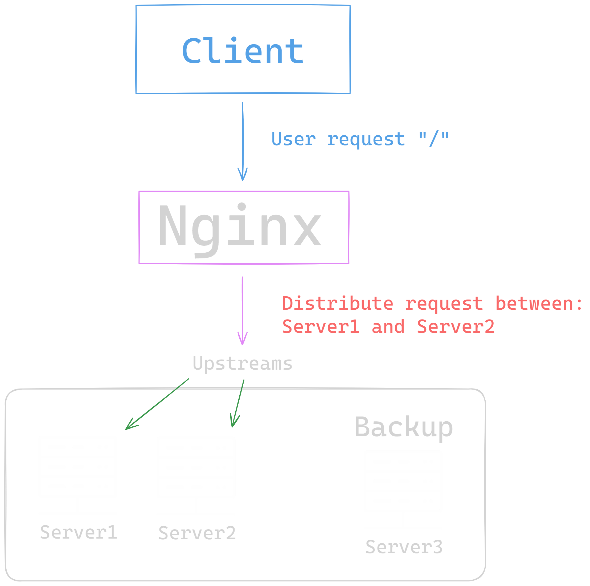
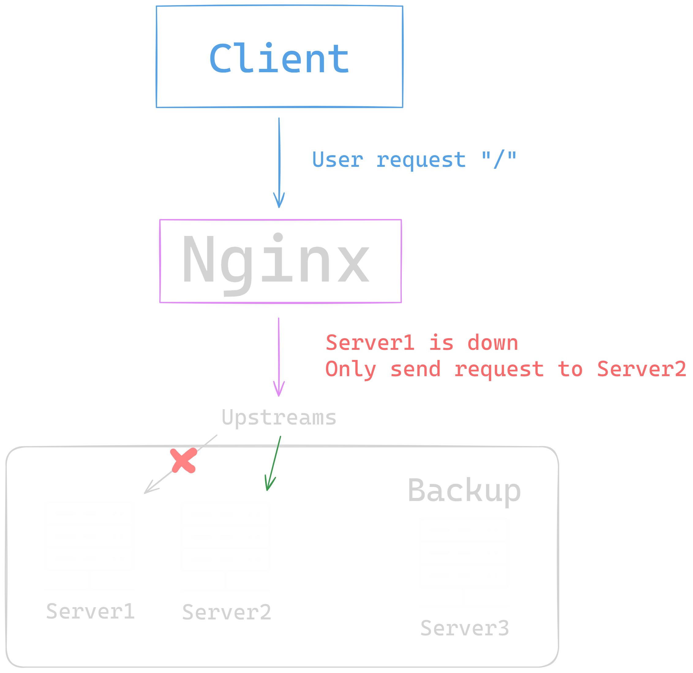
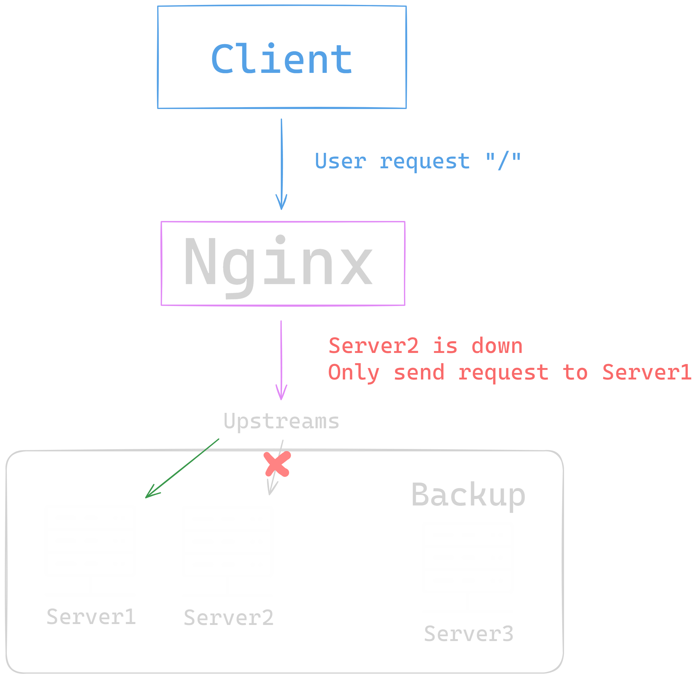
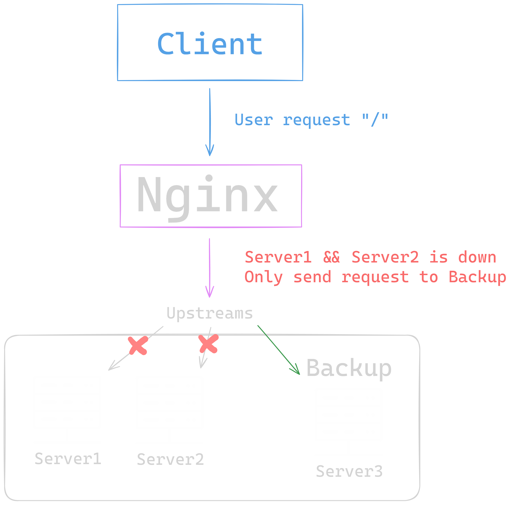

= Upstream backup

== How works?

When all servers are ok, nginx will send request to the servers

---

If for example Server1 is down, nginx will try to use Server1, if Server1 does not respond, nginx will send the request to the next server (Server2), after 5 intents the server will be mark as disabled for 30s, and when a request come nginx will skip check Server1 until the 30s ends.

---

The same for the Server2

---

If all the servers are down, then nginx uses the backup server until one of the servers are again available